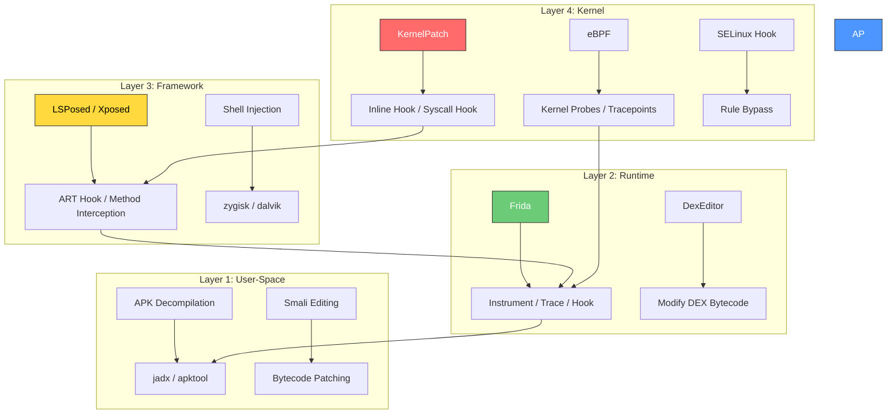

<div align="center">

# Android Rooting Masterclass

**From User-Space to Kernel — The Complete Hooking & Patching Guide**

The only resource that connects DEX editing, Xposed/LSPosed modules, and kernel patching into one coherent learning path.

[](https://github.com/ykrishhh/android-rooting-masterclass)
[](LICENSE)
[](https://www.android.com)
[](https://github.com/ykrishhh/android-rooting-masterclass/pulls)

</div>

---

I spent months piecing together how Android hooking actually works across every layer. Frida tutorials don't mention Xposed. Xposed guides ignore kernel patching. KernelPatch docs assume you already understand userspace. So I built the guide I wish existed.

This connects the dots: **DEX editing → Frida → Xposed/LSPosed → KernelPatch → eBPF**. One resource, every layer.

## The Android Hooking Stack



## What You'll Learn

### Layer 1: User-Space Analysis
- APK decompilation with jadx and apktool
- Smali syntax and bytecode editing
- Understanding DEX file format
- Static analysis techniques

### Layer 2: Runtime Hooking (Frida)
- SSL pinning bypass
- Method tracing and argument capture
- Dynamic instrumentation scripts
- Anti-debug bypass techniques

### Layer 3: Framework Hooking (Xposed/LSPosed)
- How Xposed intercepts ART methods
- Writing LSPosed modules from scratch
- Hook lifecycle and scope management
- zygisk integration

### Layer 4: Kernel Hooking (KernelPatch)
- Inline hooking without kernel source
- Syscall table modification
- SELinux rule bypass
- eBPF for kernel tracing

## The Three Paths

### Path A: Quick Hook (Frida)
Best for: Rapid prototyping, one-off analysis, security testing

```bash
# Install Frida
pip install frida-tools

# Hook a method
frida -U -f com.target.app -l hook.js

# hook.js example
Java.perform(function() {
    var TargetClass = Java.use("com.target.app.Secret");
    TargetClass.getToken.implementation = function() {
        var token = this.getToken();
        console.log("[*] Token: " + token);
        return token;
    };
});
```

**Time to first hook:** 5 minutes
**Persistence:** None (runs on attach)
**Detection difficulty:** Easy to detect

### Path B: Persistent Module (LSPosed)
Best for: System-wide modifications, user-facing features, long-term patches

```java
// LSPosed Module Example
public class MyModule extends IXposedHookLoadPackage {
    @Override
    public void handleLoadPackage(XC_LoadPackage.LoadPackageParam lpparam) {
        if (!lpparam.packageName.equals("com.target.app")) return;

        XposedHelpers.findAndHookMethod(
            "com.target.app.Secret",
            lpparam.classLoader,
            "getToken",
            new XC_MethodHook() {
                @Override
                protected void afterHookedMethod(MethodHookParam param) {
                    String token = (String) param.getResult();
                    log("[*] Token: " + token);
                }
            }
        );
    }
}
```

**Time to first module:** 30 minutes
**Persistence:** Survives reboot
**Detection difficulty:** Moderate

### Path C: Kernel Patch (KernelPatch)
Best for: Root hiding, SELinux bypass, deep system modifications

```c
// KernelPatch inline hook example
// Hook a kernel function without source code
#include <kp/kp.h>

KP_EXPORT long my_hooked_read(unsigned int fd, char __user *buf, size_t count) {
    // Custom logic before original
    printk("[KP] read intercepted: fd=%u count=%zu\n", fd, count);

    // Call original
    long ret = KP_CALL_ORIGINAL(my_hooked_read, fd, buf, count);

    // Custom logic after original
    return ret;
}
```

**Time to first patch:** 2+ hours
**Persistence:** Survives reboot (with kernel persistence)
**Detection difficulty:** Hard to detect

## Tool Comparison

| Feature | Frida | Xposed/LSPosed | KernelPatch |
|---------|-------|----------------|-------------|
| **Hook Level** | User-space | Framework (ART) | Kernel |
| **Requires Root** | No (can use frida-server) | Yes (Magisk/APatch) | Yes (APatch) |
| **Persistence** | Session only | Boot persistent | Boot persistent |
| **Performance** | Moderate overhead | Low overhead | Minimal overhead |
| **Detection** | Easy | Moderate | Hard |
| **Language** | JavaScript | Java | C/C++ |
| **Best For** | Analysis, testing | System mods, features | Root hiding, deep patches |
| **Community** | Large | Very large | Growing |
| **GitHub Stars** | 17k+ | 24k+ (LSPosed) | 1.4k |

## Projects Referenced

| Project | Stars | What It Does | Link |
|---------|-------|-------------|------|
| **LSPosed** | 24k | Xposed framework for Android | [github.com/LSPosed/LSPosed](https://github.com/LSPosed/LSPosed) |
| **KernelPatch** | 1.4k | Kernel patching without source | [github.com/bmax121/KernelPatch](https://github.com/bmax121/KernelPatch) |
| **Frida** | 17k+ | Dynamic instrumentation toolkit | [github.com/frida/frida](https://github.com/frida/frida) |
| **Magisk** | 48k+ | Android root solution | [github.com/topjohnwu/Magisk](https://github.com/topjohnwu/Magisk) |
| **APatch** | 5k+ | Kernel-based Android root | [github.com/bmax121/APatch](https://github.com/bmax121/APatch) |
| **jadx** | 43k+ | DEX to Java decompiler | [github.com/skylot/jadx](https://github.com/skylot/jadx) |
| **RePairip** | 68★ | Android repair tool by ispointer | [github.com/ispointer/RePairip](https://github.com/ispointer/RePairip) |
| **Dex2cxx** | 16★ | DEX to C++ converter by ispointer | [github.com/ispointer/Dex2cxx](https://github.com/ispointer/Dex2cxx) |

## Directory Structure

```
android-rooting-masterclass/
├── README.md                    # This file
├── 01-user-space/
│   ├── apk-decompilation.md     # jadx, apktool guide
│   ├── smali-basics.md          # Smali syntax reference
│   └── dex-format.md            # DEX file format explained
├── 02-frida/
│   ├── setup.md                 # Frida installation
│   ├── ssl-bypass.md            # SSL pinning bypass
│   ├── method-hooking.md        # Hook any method
│   └── anti-debug.md            # Bypass anti-debugging
├── 03-xposed-lsposed/
│   ├── setup.md                 # LSPosed installation
│   ├── module-dev.md            # Write your first module
│   ├── art-hooking.md           # How ART hooks work
│   └── zygisk.md                # Zygisk integration
├── 04-kernel/
│   ├── kernelpatch-setup.md     # KernelPatch installation
│   ├── inline-hooking.md        # Hook kernel functions
│   ├── syscall-hook.md          # Syscall table modification
│   └── selinux-bypass.md        # SELinux rule patching
├── 05-ebpf/
│   ├── bpf-setup.md             # eBPF on Android
│   ├── kernel-tracing.md        # Trace kernel functions
│   └── security-monitoring.md   # Security monitoring with eBPF
├── 06-advanced/
│   ├── root-hiding.md           # Hide root from detection
│   ├── integrity-bypass.md      # SafetyNet/Play Integrity
│   └── kernel-integrity.md      # Kernel integrity checks
└── scripts/
    ├── frida-hooks/             # Ready-to-use Frida scripts
    ├── lsposed-modules/         # Example LSPosed modules
    └── kp-patches/              # KernelPatch examples
```

## Getting Started

### Prerequisites

- Android device with unlocked bootloader
- Basic Linux/terminal knowledge
- ADB and fastboot installed
- Python 3.8+ (for Frida)

### Recommended Order

1. **Start with Frida** — quickest results, builds intuition
2. **Move to LSPosed** — understand ART hooking
3. **Explore KernelPatch** — for deep system modifications
4. **Combine techniques** — real-world projects use multiple layers

## Contributing

Contributions welcome. This guide is community-driven — if you've found a technique that works, share it.

1. Fork the repository
2. Create a feature branch
3. Add your technique with examples
4. Test on a real device
5. Submit a pull request

## Disclaimer

This guide is for **educational and authorized security testing purposes only**. Unauthorized modification of devices you don't own is illegal. Always obtain proper authorization before testing on devices that aren't yours.

## Credits

Built by [ykrishhh](https://github.com/ykrishhh) · Security Researcher & Developer

Inspired by the work of:
- [ispointer](https://github.com/ispointer) — Android reverse engineering and kernel bridge analysis
- [LSPosed team](https://github.com/LSPosed) — The Xposed framework reimagined
- [KernelPatch contributors](https://github.com/bmax121/KernelPatch) — Kernel patching without source

*Contact: [krishy2122@gmail.com](mailto:krishy2122@gmail.com) · [Twitter @harry6ez](https://twitter.com/harry6ez) · [Telegram @harry6e](https://t.me/harry6e)*

---

<div align="center">

*"The quieter you become, the more you can hear."*

</div>

<!-- SEO Keywords: android-rooting, lsposed, kernelpatch, frida, xposed, android-hooking, kernel-hooking, selinux-bypass, reverse-engineering, android-security, dex-editing, smali, zygisk, magisk, apatch -->
