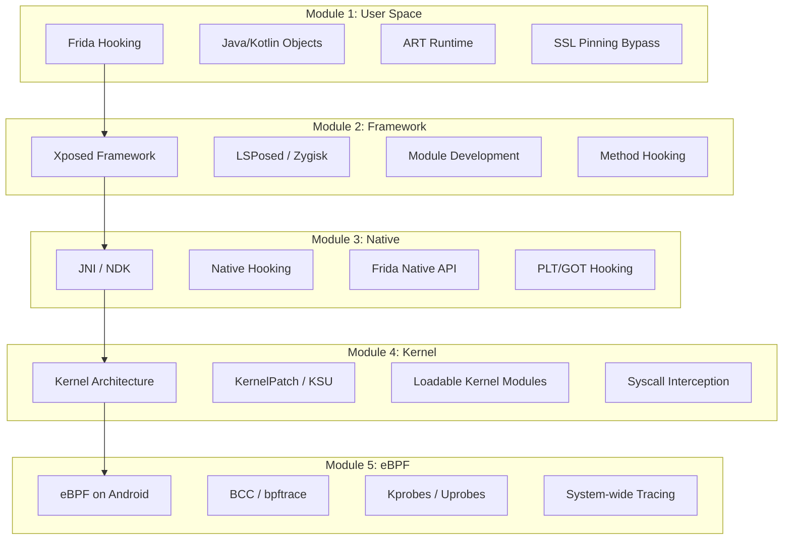

<div align="center">

# Android Rooting Masterclass

**From Frida Hooking → Xposed Modules → KernelPatch → eBPF — Complete Android Instrumentation Guide**

[](https://github.com/ykrishhh/android-rooting-masterclass)
[]()
[]()
[](LICENSE)
[](https://github.com/ykrishhh/android-rooting-masterclass/stargazers)
[](https://github.com/ykrishhh/android-rooting-masterclass/network)
[](https://github.com/ykrishhh/android-rooting-masterclass/issues)

</div>

---

## 🎯 Overview

A comprehensive, hands-on masterclass taking you from **user-space hooking** all the way to **kernel-level instrumentation** on Android. Each module builds on the previous, giving you a complete mental model of Android's security architecture and how to instrument it at every layer.

> **Target Audience**: Security researchers, reverse engineers, malware analysts, and Android enthusiasts with basic Linux/ADB knowledge.

---

## 🏗️ Learning Path Architecture



---

## 📚 Module Breakdown

### 🟢 Module 1: Frida Hooking (User Space)
| Topic | Labs | Duration |
|-------|------|----------|
| **Frida Architecture** | Client/Server, Gadget, Injection | 2h |
| **Java API Hooking** | `Java.use()`, `implementation`, `overload()` | 3h |
| **ART Runtime Internals** | Class loading, method resolution, JIT | 2h |
| **SSL Pinning Bypass** | OkHttp, Network Security Config, custom TrustManager | 2h |
| **Anti-Frida Detection** | Detection techniques & bypasses | 2h |
| **Frida RPC & Scripts** | Persistent agents, inter-script communication | 2h |

**Deliverable**: Automated SSL bypass script + anti-detection evasion module

---

### 🟡 Module 2: Xposed / LSPosed (Framework Layer)
| Topic | Labs | Duration |
|-------|------|----------|
| **Xposed Architecture** | Zygote injection, method hooking mechanism | 2h |
| **LSPosed / Zygisk** | Modern rootless implementation | 2h |
| **Module Development** | `IXposedHookLoadPackage`, `XposedHelpers` | 3h |
| **Advanced Hooking** | Constructor, field, inner class hooking | 2h |
| **Module Distribution** | Repo setup, updates, compatibility | 1h |

**Deliverable**: Custom Xposed module for target app behavior modification

---

### 🟠 Module 3: Native Hooking (NDK / JNI)
| Topic | Labs | Duration |
|-------|------|----------|
| **JNI Fundamentals** | `JNIEnv`, `jobject`, reference management | 2h |
| **PLT/GOT Hooking** | `plt_hook`, `inline_hook`, `dobby` | 3h |
| **Frida Native API** | `Interceptor`, `NativePointer`, `Memory` | 3h |
| **ELF Analysis** | Dynamic linking, relocations, symbols | 2h |
| **Anti-Debug/Anti-Hook** | `ptrace`, `isDebuggerAttached`, integrity checks | 2h |

**Deliverable**: Native library hooking toolkit with anti-anti-hook capabilities

---

### 🔴 Module 4: Kernel Instrumentation
| Topic | Labs | Duration |
|-------|------|----------|
| **Android Kernel Architecture** | GKI, vendor modules, KMI | 2h |
| **KernelPatch / KernelSU** | Patch flow, syscall hooks, overlayfs | 3h |
| **LKM Development** | `module_init`, `kallsyms`, `kprobes` | 3h |
| **Syscall Interception** | `sys_call_table`, `ftrace`, `kretprobes` | 3h |
| **Memory Management** | `vmalloc`, `kmalloc`, page tables | 2h |
| **SELinux & Permissions** | Policy analysis, `magiskpolicy`, `supolicy` | 2h |

**Deliverable**: Loadable kernel module for syscall monitoring

---

### 🟣 Module 5: eBPF on Android
| Topic | Labs | Duration |
|-------|------|----------|
| **eBPF Fundamentals** | Verifier, maps, helpers, CO-RE | 3h |
| **BCC / bpftrace on Android** | Cross-compilation, Android-specific helpers | 3h |
| **Kprobes / Uprobes** | Kernel/userspace tracing, USDT | 2h |
| **Network Tracing** | `tc` classifier, XDP, socket filters | 2h |
| **Security Monitoring** | File integrity, process exec, capability tracking | 2h |
| **Production Deployment** | Minimal footprint, persistent loading | 2h |

**Deliverable**: eBPF-based system-wide security monitor

---

## 🛠️ Prerequisites

| Requirement | Specification |
|-------------|---------------|
| **Device** | Pixel 6/7/8 (unlockable bootloader) or emulator |
| **Android** | 12+ (API 31+) for LSPosed/eBPF |
| **Host OS** | Linux (Ubuntu 22.04+) or macOS |
| **Tools** | ADB, Fastboot, Python 3.10+, Docker |
| **Knowledge** | Basic Linux, Java/Kotlin, C basics |

---

## 📁 Repository Structure

```
android-rooting-masterclass/
├── module-01-frida/
│   ├── labs/
│   │   ├── 01-setup/
│   │   ├── 02-java-hooking/
│   │   ├── 03-art-internals/
│   │   ├── 04-ssl-bypass/
│   │   ├── 05-anti-frida/
│   │   └── 06-rpc-scripts/
│   ├── scripts/
│   │   ├── universal_ssl_bypass.js
│   │   ├── anti_detection_evasion.js
│   │   └── hooking_templates/
│   └── solutions/
├── module-02-xposed/
│   ├── labs/
│   │   ├── 01-architecture/
│   │   ├── 02-lsposed-setup/
│   │   ├── 03-module-dev/
│   │   ├── 04-advanced-hooking/
│   │   └── 05-distribution/
│   ├── example-module/
│   │   ├── src/main/java/com/example/xposed/
│   │   ├── build.gradle.kts
│   │   └── AndroidManifest.xml
│   └── solutions/
├── module-03-native/
│   ├── labs/
│   │   ├── 01-jni-fundamentals/
│   │   ├── 02-plt-got-hooking/
│   │   ├── 03-frida-native/
│   │   ├── 04-elf-analysis/
│   │   └── 05-anti-anti-hook/
│   ├── toolkit/
│   │   ├── dobby_wrapper/
│   │   ├── frida_native_helpers/
│   │   └── hook_templates/
│   └── solutions/
├── module-04-kernel/
│   ├── labs/
│   │   ├── 01-kernel-arch/
│   │   ├── 02-kernelpatch-ksu/
│   │   ├── 03-lkm-development/
│   │   ├── 04-syscall-interception/
│   │   ├── 05-memory-mgmt/
│   │   └── 06-selinux/
│   ├── lkm-examples/
│   │   ├── syscall_monitor/
│   │   ├── file_monitor/
│   │   └── net_filter/
│   └── solutions/
├── module-05-ebpf/
│   ├── labs/
│   │   ├── 01-ebpf-fundamentals/
│   │   ├── 02-bcc-bpftrace-android/
│   │   ├── 03-kprobes-uprobes/
│   │   ├── 04-network-tracing/
│   │   ├── 05-security-monitoring/
│   │   └── 06-production-deployment/
│   ├── tools/
│   │   ├── syscall_tracer.bt
│   │   ├── file_integrity.bt
│   │   ├── process_monitor.bt
│   │   └── net_tracer.bt
│   └── solutions/
├── assets/
│   ├── diagrams/
│   ├── screenshots/
│   └── cheatsheets/
├── docker/
│   ├── Dockerfile.frida
│   ├── Dockerfile.kernel
│   └── Dockerfile.ebpf
├── LICENSE
└── README.md
```

---

## ⚡ Quick Start

```bash
# Clone repository
git clone https://github.com/ykrishhh/android-rooting-masterclass.git
cd android-rooting-masterclass

# Setup Frida environment
cd module-01-frida
pip install -r requirements.txt
frida --version  # Verify installation

# Start with Module 1, Lab 1
cd labs/01-setup
./setup.sh

# Follow lab instructions in each lab/README.md
```

---

## 🎓 Learning Outcomes

By completing this masterclass, you will be able to:

- ✅ **Reverse engineer** any Android application at multiple layers
- ✅ **Bypass** SSL pinning, root detection, anti-debug, anti-hook mechanisms
- ✅ **Develop** Xposed/LSPosed modules for runtime behavior modification
- ✅ **Hook** native libraries via PLT/GOT, inline, and Frida Native API
- ✅ **Build** loadable kernel modules for syscall interception
- ✅ **Deploy** eBPF programs for system-wide observability
- ✅ **Understand** Android's security model from userspace to kernel

---

## 🗺️ Roadmap

- [ ] **Video walkthroughs** for each lab (YouTube playlist)
- [ ] **ARM64-specific** kernel exploitation module
- [ ] **Hypervisor-based** instrumentation (KVM/nVHE)
- [ ] **Pixel 8/9** specific GKI modules
- [ ] **GrapheneOS / CalyxOS** hardening analysis

---

## ⚖️ Ethics & Legal

This course is for **authorized security research and education only**. 
- Only test on devices you own or have explicit permission to test
- Respect intellectual property and terms of service
- Follow responsible disclosure for vulnerabilities found

---

## 🤝 Contributing

See [CONTRIBUTING.md](CONTRIBUTING.md) for guidelines.

---

## 📄 License

MIT License — see [LICENSE](LICENSE) for details.

---

<div align="center">

Made with ❤️ by [Krish](https://github.com/ykrishhh) | [Portfolio](https://harrydev.one) | [Twitter](https://x.com/ykrishhh)

</div>

## Architecture

Explore interactive diagrams of this project's architecture: [docs/architecture.html](docs/architecture.html).
