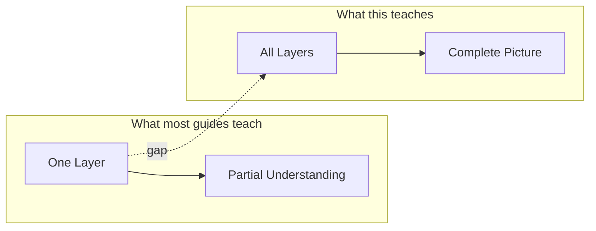
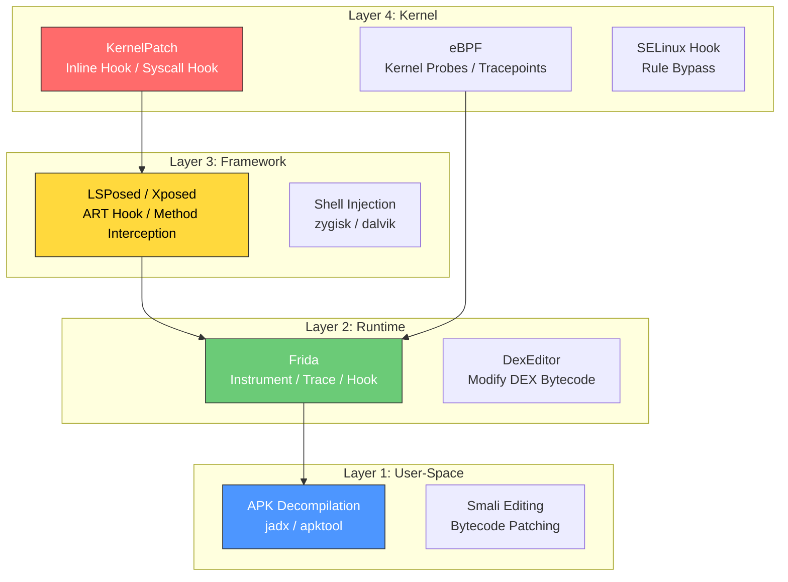

<div align="center">

# Android Rooting Masterclass

**From User-Space to Kernel — The Complete Hooking & Patching Guide**

The only resource that connects DEX editing, Xposed/LSPosed modules, and kernel patching into one coherent learning path.

[](https://github.com/ykrishhh/android-rooting-masterclass)
[](LICENSE)
[](https://www.android.com)
[](https://github.com/ykrishhh/android-rooting-masterclass/pulls)

</div>

---

I've been doing Android reverse engineering for a while now. One thing that always bugged me — every guide teaches one layer and pretends the others don't exist. Frida tutorials never mention Xposed. Xposed guides ignore kernel patching. KernelPatch docs assume you already understand userspace hooking.

So I built the thing I kept looking for and never found.

This connects everything: **DEX editing → Frida → Xposed/LSPosed → KernelPatch → eBPF**. One place, every layer, actual code you can run.

## Why This Exists



I got tired of the fragmented state of Android RE education. Here's what I ran into:

- **Frida guides** teach you to hook methods but never explain what happens at the ART level
- **Xposed tutorials** show module examples but skip the classloader mechanics
- **KernelPatch docs** jump straight to inline hooking without explaining syscalls
- **Rooting guides** focus on Magisk and ignore the kernel internals

This repo fixes that. Each layer builds on the previous one. By the end, you understand the entire stack.

## The Android Hooking Stack



### Layer 1: User-Space (No Root Needed)

This is where everyone starts. APK files are just ZIP archives — decompile them, read the code, modify what you want.

**Tools:**
- **jadx** — decompiles DEX to readable Java. 43k+ stars for a reason.
- **apktool** — decompiles to Smali (bytecode). More useful than jadx when you actually want to modify things.

**What I learned the hard way:** Don't start with jadx. Start with apktool. You'll learn more about how Android actually works by reading Smali than by reading decompiled Java.

### Layer 2: Runtime Hooking (Frida)

Frida is JavaScript for native apps. You write a script, it injects into the target process, and you can hook any function, trace any call, modify any return value.

```javascript
// This is what a Frida hook actually looks like
Java.perform(function() {
    var Secret = Java.use("com.target.app.Secret");
    
    Secret.getToken.implementation = function() {
        var token = this.getToken();
        console.log("[*] Token intercepted: " + token);
        return token;
    };
});
```

**Why Frida first:** It's the fastest way to get results. No compilation, no rebooting, no framework setup. Attach, hook, done.

**What Frida can't do:** Survive app restarts. Run at boot. Modify system services. That's where Layer 3 comes in.

### Layer 3: Framework Hooking (Xposed/LSPosed)

Xposed intercepts methods at the ART (Android Runtime) level. Instead of injecting into a process like Frida, it modifies the runtime itself. Every method call goes through Xposed's interception layer.

**LSPosed** is the modern version. It works with Magisk/APatch and uses zygisk for injection. The API is clean:

```java
public class MyModule extends IXposedHookLoadPackage {
    @Override
    public void handleLoadPackage(XC_LoadPackage.LoadPackageParam lpparam) {
        if (!lpparam.packageName.equals("com.target.app")) return;

        XposedHelpers.findAndHookMethod(
            "com.target.app.Secret",
            lpparam.classLoader,
            "getToken",
            new XC_MethodHook() {
                @Override
                protected void afterHookedMethod(MethodHookParam param) {
                    String token = (String) param.getResult();
                    log("[*] Token: " + token);
                }
            }
        );
    }
}
```

**The key insight:** Xposed hooks persist across app restarts because they modify the runtime, not the process. A reboot and your hook is still there.

### Layer 4: Kernel Hooking (KernelPatch)

This is where things get serious. KernelPatch lets you hook kernel functions **without the kernel source code**. It works by patching the running kernel image directly.

```c
// KernelPatch inline hook — no source needed
#include <kp/kp.h>

KP_EXPORT long my_hooked_read(unsigned int fd, char __user *buf, size_t count) {
    printk("[KP] read intercepted: fd=%u count=%zu\n", fd, count);
    long ret = KP_CALL_ORIGINAL(my_hooked_read, fd, buf, count);
    return ret;
}
```

**Why kernel patching matters:** Everything above the kernel can be detected. App integrity checks, SafetyNet, Play Integrity — they all trust the kernel. If you control the kernel, you control everything.

**What KernelPatch does differently:** Traditional kernel root (like old-school KNOX exploits) required modifying the kernel source and recompiling. KernelPatch works on stripped kernel images. No source needed.

## Tool Comparison

| | Frida | LSPosed | KernelPatch |
|---|---|---|---|
| **Hook Level** | User-space | Framework (ART) | Kernel |
| **Requires Root** | Optional | Yes | Yes |
| **Survives Reboot** | No | Yes | Yes |
| **Performance** | Moderate overhead | Low | Minimal |
| **Detection** | Easy | Moderate | Hard |
| **Language** | JavaScript | Java | C/C++ |
| **Time to First Hook** | 5 min | 30 min | 2+ hours |
| **Best For** | Analysis, testing | System mods, features | Root hiding, deep patches |

## Learning Paths

### Path A: "I just want to hook stuff fast"


Frida → done. You'll have a working hook in 5 minutes.

### Path B: "I want persistent modifications"


LSPosed → modules that survive reboots.

### Path C: "I want to own the kernel"


KernelPatch → you're operating at the deepest level.

## Projects That Inspired This

| Project | Stars | What It Does | Link |
|---------|-------|-------------|------|
| **LSPosed** | 24k | Xposed framework for Android | [LSPosed/LSPosed](https://github.com/LSPosed/LSPosed) |
| **KernelPatch** | 1.4k | Kernel patching without source | [bmax121/KernelPatch](https://github.com/bmax121/KernelPatch) |
| **Frida** | 17k+ | Dynamic instrumentation toolkit | [frida/frida](https://github.com/frida/frida) |
| **Magisk** | 48k+ | Android root solution | [topjohnwu/Magisk](https://github.com/topjohnwu/Magisk) |
| **APatch** | 5k+ | Kernel-based Android root | [bmax121/APatch](https://github.com/bmax121/APatch) |
| **jadx** | 43k+ | DEX to Java decompiler | [skylot/jadx](https://github.com/skylot/jadx) |
| **RePairip** | 68★ | Android repair tool | [ispointer/RePairip](https://github.com/ispointer/RePairip) |
| **Dex2cxx** | 16★ | DEX to C++ converter | [ispointer/Dex2cxx](https://github.com/ispointer/Dex2cxx) |

## Directory Structure

```
android-rooting-masterclass/
├── README.md
├── assets/                      # Diagrams and images
│   ├── stack-overview.svg
│   ├── frida-flow.svg
│   ├── lsposed-flow.svg
│   └── kernelpatch-flow.svg
├── 01-user-space/
│   ├── apk-decompilation.md
│   ├── smali-basics.md
│   └── dex-format.md
├── 02-frida/
│   ├── setup.md
│   ├── ssl-bypass.md
│   ├── method-hooking.md
│   └── anti-debug.md
├── 03-xposed-lsposed/
│   ├── setup.md
│   ├── module-dev.md
│   ├── art-hooking.md
│   └── zygisk.md
├── 04-kernel/
│   ├── kernelpatch-setup.md
│   ├── inline-hooking.md
│   ├── syscall-hook.md
│   └── selinux-bypass.md
├── 05-ebpf/
│   ├── bpf-setup.md
│   ├── kernel-tracing.md
│   └── security-monitoring.md
├── 06-advanced/
│   ├── root-hiding.md
│   ├── integrity-bypass.md
│   └── kernel-integrity.md
└── scripts/
    ├── frida-hooks/
    ├── lsposed-modules/
    └── kp-patches/
```

## Getting Started

```bash
# 1. Get the tools
pip install frida-tools          # Frida
brew install jadx                # Decompile (or download from GitHub)

# 2. Set up ADB
adb devices                      # Verify connection

# 3. Start with Frida
frida-ps -U                      # List running processes
frida -U -f com.target.app -l hook.js  # Attach and hook

# 4. When ready for persistence, root with Magisk/APatch
# 5. Install LSPosed module
# 6. Graduate to KernelPatch when you need kernel-level access
```

## Contributing

If you've found a technique that works, share it. This guide is community-driven.

1. Fork the repo
2. Add your technique with working code examples
3. Test on a real device (not just an emulator)
4. Submit a PR with a clear description of what you tested and on what device/Android version

## Disclaimer

This is for **educational and authorized security testing only**. Don't modify devices you don't own. Don't use this for malicious purposes. I built this to learn and to help others learn — not to enable abuse.

## Credits

Built by [ykrishhh](https://github.com/ykrishhh) · Security Researcher & Developer

Big thanks to:
- [ispointer](https://github.com/ispointer) — his work on Android reverse engineering and kernel bridge analysis directly inspired the Layer 4 section
- [LSPosed team](https://github.com/LSPosed) — rebuilt Xposed for the modern Android stack
- [KernelPatch contributors](https://github.com/bmax121/KernelPatch) — proved you don't need kernel source to patch the kernel

*Contact: [krishy2122@gmail.com](mailto:krishy2122@gmail.com) · [Twitter @harry6ez](https://twitter.com/harry6ez) · [Telegram @harry6e](https://t.me/harry6e)*

---

<div align="center">

*"The quieter you become, the more you can hear."*

</div>

<!-- SEO Keywords: android-rooting, lsposed, kernelpatch, frida, xposed, android-hooking, kernel-hooking, selinux-bypass, reverse-engineering, android-security, dex-editing, smali, zygisk, magisk, apatch -->
